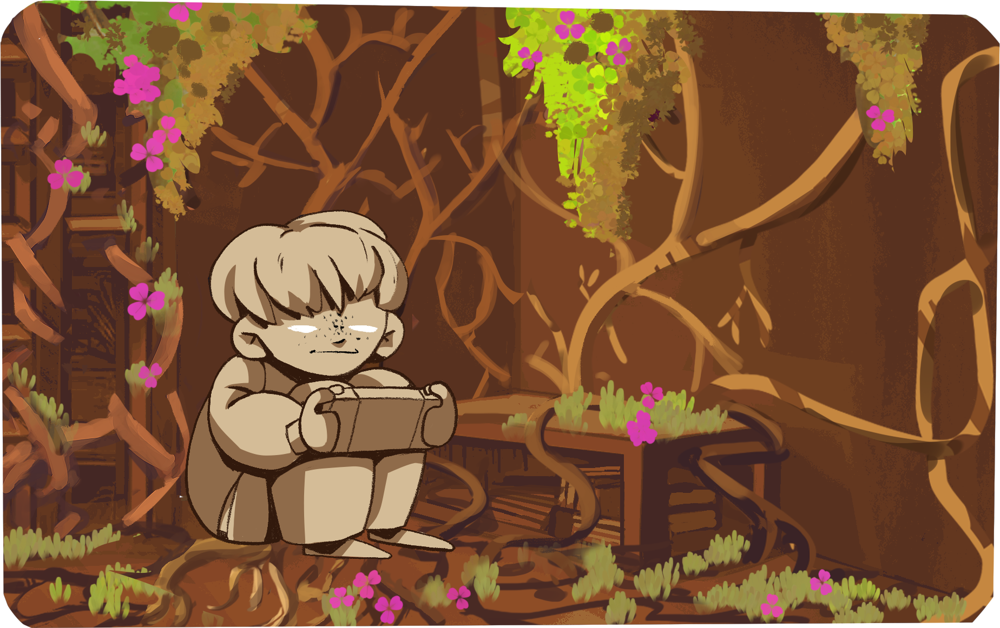

# DEEP-ROOTED

GGJ 2023 entry

A card battling game about growing roots of misanthropy. Avoid real life! Become a vegetable!

### Team

- Valeriy Meleshkin 
- Timur Yanberdin 
- Vasiliy Most 
- Nararcher 
- Angela Yanberdina

### Extra Credits

- This project includes some resources from Text Mesh Pro
- A font from the Google Fonts library https://fonts.google.com/specimen/Bowlby+One+SC?preview.text=Deep-rooted&preview.text_type=custom
- The letterboxer script https://github.com/RyanNielson/Letterboxer
- Probably something else we forgot to credit during the jam. If that's the case we are very sorry — ping me I'll add the credits.